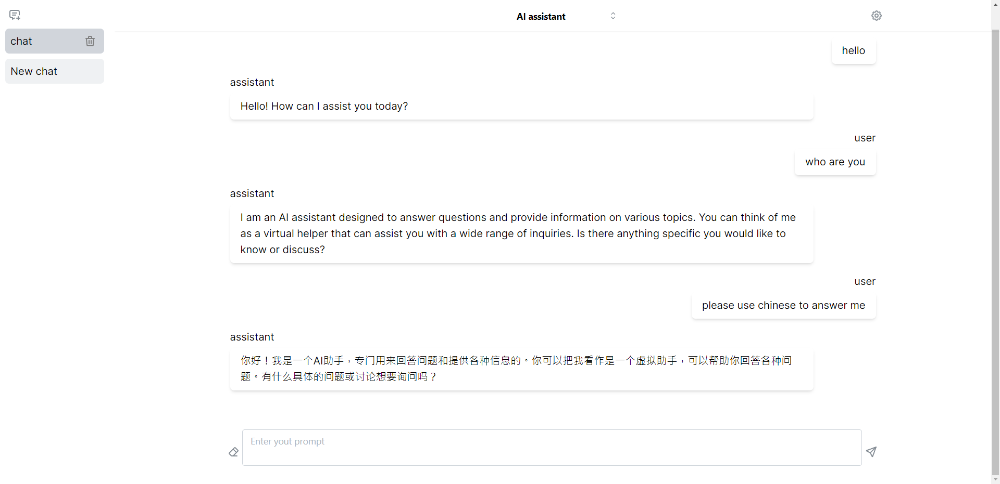

這是一個基於 chatgpt api 實作的 ai 助手範例，啟動需要先申請 [User settings - OpenAI API](https://platform.openai.com/settings/profile?tab=api-keys) 的 token 並放入 env 文件中

```
OPENAI_API_KEY=XXXXXXXXXXXXXXXXXXXXXXXXXXX
GPT_END_POINT=https://api.openai.com
```

接下來會從搭建應用的角度看如何構建一個基於 chatgpt api 的產品

如果簡單將 ai 功能的開發分為 3 個等級：

1. 底層庫，開發算法相關等 ai 底層原理的技術

2. 參數訓練，使用已經完成的 AI 庫 transflow、stable diffusion，透過給予不同資料進行訓練能夠取得不同的成果

3. 直接調用，如 open ai 提供的所有 api

第三種開發方式，開發者可以不關心 ai 底層運作邏輯和訓練過程，透過直接調用 opean ai 提供的 api 建立一個應用

#### 透過第三方服務建立應用

如果要快速開發一個對話型的 ai 產品：

登入可以使用 google auth api

對話功能使用 open ai 提供的 api

資料存儲可以使用 [Strapi - Open source Node.js Headless CMS 🚀](https://strapi.io/)提供的 headless api 服務

什麼是 headless api

[https://www.ramotion.com/blog/what-is-a-headless-website/](https://www.ramotion.com/blog/what-is-a-headless-website/)

簡單來說 headless api 沒有前端介面，而是讓其他開發者直接調用開放 api 去搭建應用，這類產品的好處就在於上層開發者不用關心底層設施的構建，api 提供者不用關心每個用戶，比如說 shopify 能提供相應的 api ，讓更多的開發者基於它們的 api 構建個性化的電商官網

更多功能的 api 會有很多 api 提供公司提供，比如專門面向內容管理的 strapi 或是一些整合開放 api 的公司 [https://rapidapi.com/collection/popular-apis](https://rapidapi.com/collection/popular-apis)

#### 框架選型

有了這些 api 那對應用層的開發者還缺少什麼呢？缺少一個能夠快速集成這些 api 的框架，Nextjs 可能是其中最受歡迎的

nextjs 是基於 React 基底，更上層的集成框架 meta framework，在 github 上面可以找到許多用 nextj 搭建的 chatgpt 應用

[ChatGPTNextWeb/ChatGPT-Next-Web: A cross-platform ChatGPT/Gemini UI (Web / PWA / Linux / Win / MacOS). 一键拥有你自己的跨平台 ChatGPT/Gemini 应用。 (github.com)](https://github.com/ChatGPTNextWeb/ChatGPT-Next-Web)

nextjs 相對來說最特別也是一般開發者比較難以實現的功能，ssr

(https://medium.com/web-design-zone/%E6%90%9E%E6%87%82%E5%89%8D%E7%AB%AF%E6%8A%80%E8%A1%93%E5%90%8D%E8%A9%9E-ssr%E8%88%87spa-450563784c47)[https://medium.com/web-design-zone/搞懂前端技術名詞-ssr與spa-450563784c47](https://medium.com/web-design-zone/%E6%90%9E%E6%87%82%E5%89%8D%E7%AB%AF%E6%8A%80%E8%A1%93%E5%90%8D%E8%A9%9E-ssr%E8%88%87spa-450563784c47)

簡單來說就是讓 react 支援傳統的 seo

以及 nextjs 整合了自家公司的雲服務，基本上能很容易實現一鍵部署

(https://vercel.com/louis61619s-projects)[https://vercel.com/](https://vercel.com/)

透過使用 nextjs 和廠商提供的 api 能夠快速輕鬆的建立一個網站

Nextjs 的優缺點：

Nextjs 框架基本上是由 vercel 公司聘請 facebook 當初做 react 的工程師做成的，react 19 之後許多特性基本上是為 Nextjs 提供的，可以說是有最頂尖工程師和原廠支援打造的上層框架，不過就開發相對激進一點，提供了很多實驗性質的 api，而且版本迭代非常快，前後版本所推的主流使用方式可能完全不同

#### chatgpt api 基本的核心概念

[https://platform.openai.com/docs/api-reference/assistants/createAssistant](https://platform.openai.com/docs/api-reference/assistants/createAssistant)

token： 計算基本單元 ，紀錄最大程度的上下文，舊版 chatgpt 3.5 是 4000 token，就是 2k字，超過就不會記錄上下文，新版可以支援到 1.6w token，[https://platform.openai.com/tokenizer?view=bpe](https://platform.openai.com/tokenizer?view=bpe) 可以看到一個字多少 token

Model：模型，比如 chat-gpt 3.5、chat-gpt 4

prompt：用戶輸入指令

api 文檔：
[API Reference - OpenAI API](https://platform.openai.com/docs/api-reference/introduction)

那調用一次 api 要多少錢？

[https://openai.com/pricing](https://openai.com/pricing)

常用的 chatgpt 3.5

input $0.50 / 1M tokens 1百萬token 0.5 美元

output $1.50/ 1M tokens 1百萬token 1.5 美元

#### 直接使用 fetch 進行請求範例

```jsx
const data = {
    model: 'gpt-3.5-turbo',
    messages: [
      {
        role: 'system',
        content: 'I am an ai assistant',
      },
      // ...history,
      {
        role: 'user',
        content: 'what can you do?',
      },
    ],
    temperature: +temperature || 0.7,
    max_tokens: +max_tokens || 1000,
  }
  
  const resp = await fetch(`${process.env.GPT_END_POINT}/v1/chat/completions`, {
    headers: {
      Authorization: `Bearer ${process.env.OPENAI_API_KEY}`,
      'Content-Type': 'application/json',
    },
    method: 'POST',
    body: JSON.stringify(payload),
  });
```

上面是一個 api 請求的案例，可以看到基本上就一般的 restful api，也就是說他本身是無狀態的，並不會跟據使用者來紀錄任何對話或內容。
#### 使用 open api 提供的庫

相對一般的restful api，chatgpt api提供的回覆內容可以是一個stream 流，由於 chatgpt 本身需要不斷計算下一個字的回應，所以透過 stream 流的方式能將先響應回來的字一個個返回給用戶

可以透過 stream 參數開啟，chatgpt 有提供 nodejs 庫對於常用方法進行封裝，處理 stream 流也是比較複雜的，相對來說使用開源的庫就會快很多

[https://github.com/openai/openai-node](https://github.com/openai/openai-node)

### Prompt

通常來說透過簡單對 chatgpt api 定義他自己是誰，能起到一個很方便的作用，這也是大部分產品的基礎，也就是在 system 裡面加上某些定義

```jsx
const data = {
    model: 'gpt-3.5-turbo',
    messages: [
      {
        role: 'system',
        content: "你現在是一個英文老師，之後我輸入的每一句中文都翻譯成英文，並解釋文法",
      },
      ...history,
      {
        role: 'user',
        content: prompt,
      },
    ],
    ....
  }
```

相對來說使用上還是比較容易的，不過複雜的部分在後續對於結果的驗證上，以及如何在各種情境下得出想要的結果。

